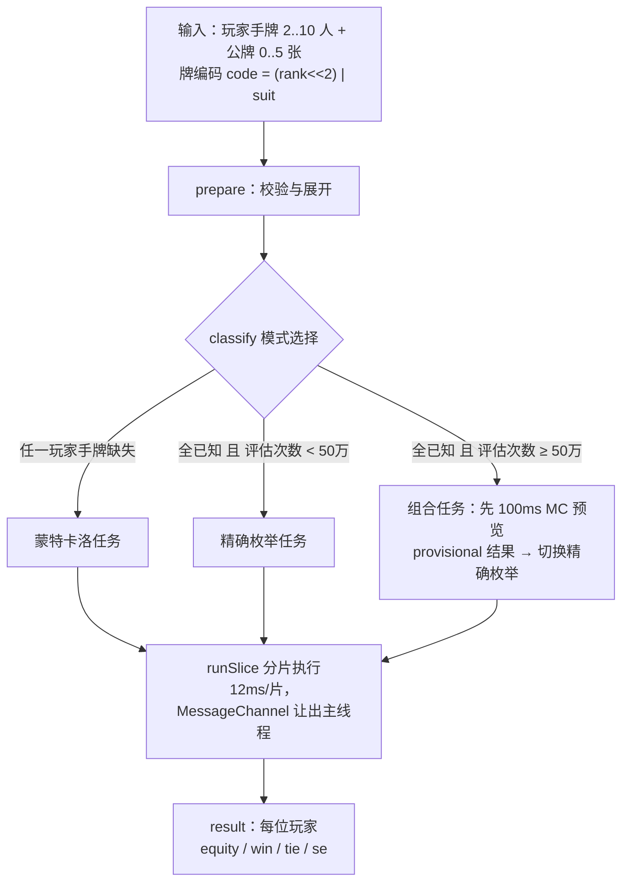
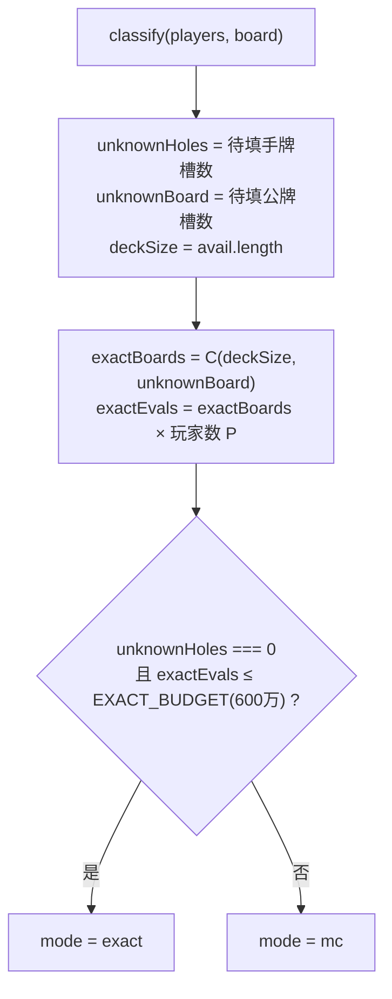
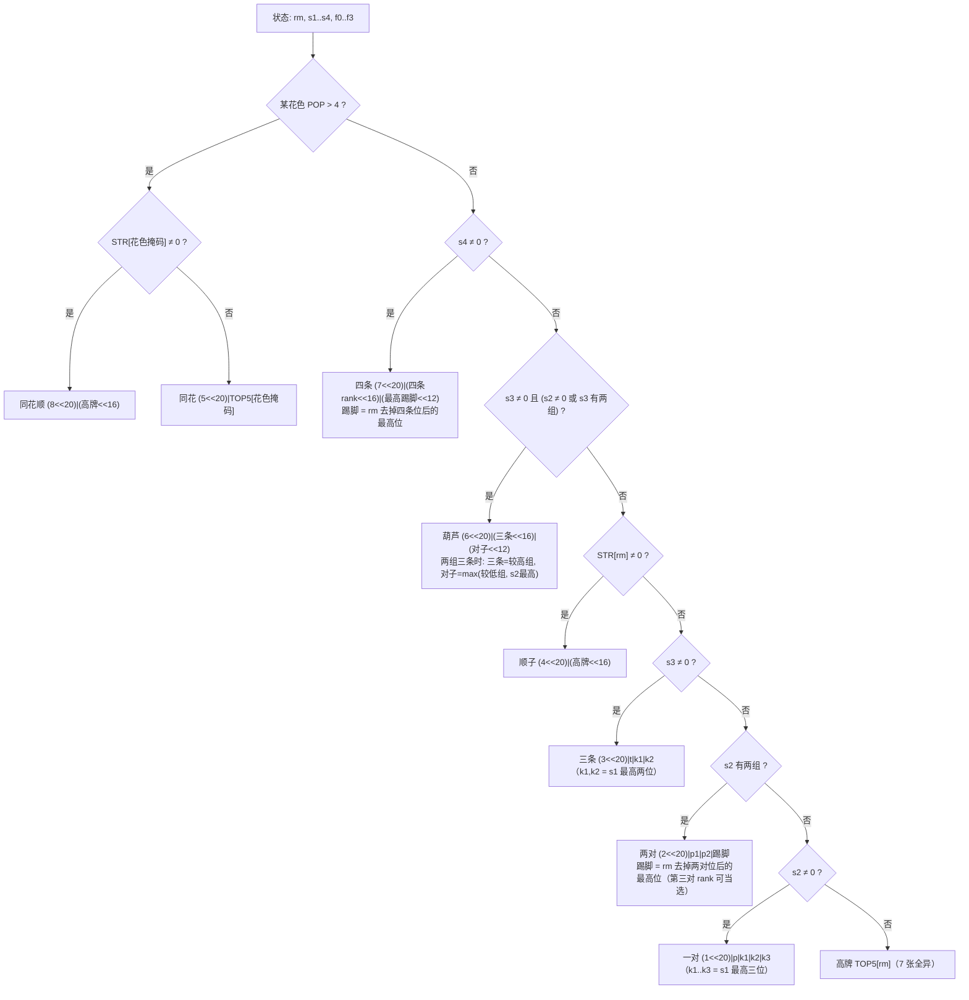
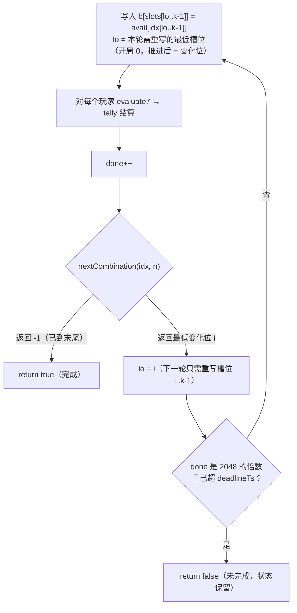
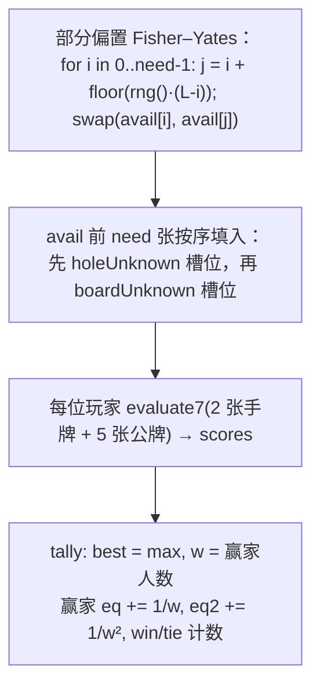
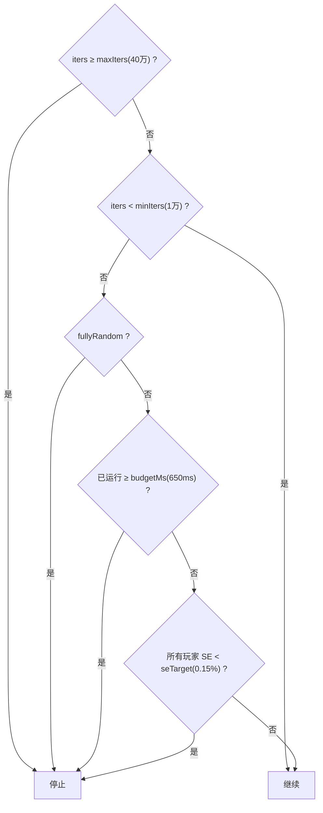

# 胜率计算核心算法 — 实现文档

本文档描述德州扑克胜率计算器的概率计算核心（`js/engine.js` + `js/evaluator.js`），
与代码严格对应。文中所有阈值均为代码中的实际常量。

---

## 1. 总览

一次计算的完整流程：



**核心思想**：概率计算只有两种引擎——

- **精确枚举**：所有玩家手牌已知时，枚举全部可能的公牌组合（翻牌前最多 C(48,5) = 1,712,304 种），每个局面逐一对决，结果精确到浮点精度。
- **蒙特卡洛**：任一玩家手牌缺失时（对手牌组合做嵌套枚举会组合爆炸），随机发牌模拟，按时间预算与统计精度提前停止。

**统一的结算规则**（两种引擎共用 `tally()`）：每个局面求各玩家 7 张牌的最高分，
`best` 为最高分，`w` 为达到 best 的玩家人数——

```
equity[p] += 1/w   （p ∈ 赢家；平局按人头均分摊入胜率）
w == 1 ? win[p]++  : tie[p]++
```

即 **胜率 equity = 单独获胜概率 + 平局均分期望**，所有玩家 equity 之和恒等于 1。

---

## 2. 输入表示与预处理（`prepare`）

牌编码：`code = (rank << 2) | suit`，rank 0..12 对应 2..A，suit 0..3 对应 ♠♥♦♣，
恰好 0..51 可直接作牌堆下标。

`prepare(players, board)` 做四件事：

1. **校验**（`Cards.validateInputs`）：玩家 2..10 人、每人 2 个槽位、公牌 ≤ 5、
   全局无重复牌、编码合法——违规抛出中文错误信息。
2. **展开**：`holes: Int32Array(2P)`（-1 = 未知手牌）、`b: Int32Array(5)`
   （-1 = 未知公牌；**board 不足 5 张的部分视为未知**，即翻牌阶段自动补发转牌河牌）。
3. **待填槽位清单**：`holeUnknown`（玩家未知手牌的槽位下标）、`boardUnknown`（未知公牌槽位）。
4. **可用牌堆** `avail`：52 张减去全部已知牌（含可选的死牌 `deadCards`——
   不参与计算的玩家已亮出的牌，见 §7 注）。

派生量：`fullyRandom = (holeUnknown.length === 2P)`——是否所有玩家手牌都未指定（见 §7）。

---

## 3. 模式选择（`classify` → `createTask`）



`createTask` 在模式之上叠加**预览策略**：

| 条件 | 任务 |
|---|---|
| mode = mc | 直接蒙特卡洛 |
| mode = exact 且 exactEvals < `PREVIEW_EVALS`(50 万) | 直接精确枚举（河牌/转牌/翻牌/轻量翻牌前，<10ms） |
| mode = exact 且 exactEvals ≥ 50 万 | **组合任务**：先跑 100ms 蒙特卡洛预览（`result.provisional = true`），完成后无缝切换精确枚举 |

预览策略只服务于一种真实场景：**翻牌前全已知**（exactEvals 170 万–430 万，桌面 200–360ms、
手机约 1.5–2s）。预览让用户在 ~100ms 内看到收敛中的估计值，精确值随后无缝替换。
两个阈值（`PREVIEW_EVALS` 与 `EXACT_BUDGET`）都定义在引擎侧——UI 层不做任何策略决策。

---

## 4. 7 张牌评估器（`Evaluator.evaluate7`）

输入 7 张牌编码，输出一个**可直接比较的整数分数**，分数越大牌型越强。
单次调用零内存分配，实测吞吐约 **2600 万次/秒**（Node 24）。

### 4.1 分数布局

```
score = (category << 20) | (v1 << 16) | (v2 << 12) | (v3 << 8) | (v4 << 4) | v5

category: 0=高牌 1=一对 2=两对 3=三条 4=顺子 5=同花 6=葫芦 7=四条 8=同花顺
v1..v5:   比较用的踢脚牌值（2..14，恰好各占 4 位）
```

同 category 比踢脚字段，跨 category 由高 4 位直接决胜。

### 4.2 三张查表（启动时构建 8192 = 2¹³ 项，<2ms）

| 表 | 输入：13 位 rank 掩码 | 输出 |
|---|---|---|
| `STR[m]` | — | 最高顺子高牌值 5..14（无顺子 = 0）；**轮子 A2345 = 5**（掩码位 12 与 0..3，即 `m & 0x100F === 0x100F`） |
| `POP[m]` | — | popcount（1 的个数） |
| `TOP5[m]` | — | 掩码中最高 5 个 rank 打包成 5 个 4 位字段（高位在前） |

### 4.3 逐张处理（7 次重复，手工展开）

每张牌 `c`：

```
r = c >> 2;  x = 1 << r;  rm |= x        // 全体 rank 掩码
出现次数状态机（恰 k 次的 rank 集合）:
    s1 & x ? (s1^=x; s2|=x)              // 第 2 张 → s2
  : s2 & x ? (s2^=x; s3|=x)              // 第 3 张 → s3
  : s3 & x ? (s3^=x; s4|=x)              // 第 4 张 → s4
  : s1 |= x                              // 第 1 张 → s1
花色掩码: 按 c & 3 分派 f0/f1/f2/f3（各 |= x）
```

> 关键不变式：7 张牌内**同花不可能与四条/葫芦共存**（4+5 或 3+5 > 7 张），
> 因此同花可以最先判定并直接返回，无需担心更高牌型被掩盖。

### 4.4 判定链



两处易错细节（已被测试钉死）：

- **两组三条**（如 777 333 QQ）：葫芦 = 较高三条 + max(较低三条, 最高对子)，即上例取 777+QQ。
- **三对**（如 AA KK QQ x）：两对取最高两对，**第三对的 rank 与杂牌一起参与踢脚竞争**
  （踢脚直接取 `rm` 去掉两对位后的最高位）。

---

## 5. 精确枚举（`createExactTask`）

前置条件：所有玩家手牌已知（`prepare` 后 `holeUnknown.length === 0`）。

枚举对象：向 `boardUnknown` 个未知公牌槽填入 `avail` 中牌的**全部组合**
（`C(deckSize, k)` 种，k = 0..5；k=0 即河牌已齐，只有 1 个"组合"）。

### 5.1 里程计式枚举

用一组下标 `idx[0..k-1]`（严格递增，指向 `avail`）表示当前组合，
**状态即数据**——不递归、无栈，天然可暂停恢复：



`nextCombination(idx, n)`：从最右位找第一个能增量的下标 `i`（`idx[i] < n-k+i`），
`idx[i]++` 后把右侧各位重置为紧随其后的连续值；返回最低变化位，耗尽返回 -1。
此函数同时被测试的校验和枚举复用（单一实现）。

**最小写入优化**：推进只改变位 `i..k-1`，低位（`0..i-1`）与上轮相同，
`b` 中对应槽位无需重写——实测 2 人翻牌前 7.5%、5 人 3.9% 提速。

**恢复语义**：`runSlice` 返回 false 时，`idx` 已指向**下一个未评估**的组合
（先评估、再推进、最后检查时限的顺序保证了不重不漏）；下次调用从 `lo = i` 继续，
低位槽位保留上次写入的正确值。切片粒度：每 2048 个局面检查一次 `performance.now()`
（约 0.1–0.3ms 的检查间隔，粒度开销可忽略）。

### 5.2 实测耗时（本机 Node 24）

| 场景 | 局面数 | 评估次数 | 耗时 |
|---|---|---|---|
| 2 人翻牌前 | 1,712,304 | 342 万 | 194ms |
| 5 人翻牌前（最重） | 850,668 | 425 万 | 250ms |
| 3 人翻牌（board 3 已知） | 990 | ~3000 | <1ms |

---

## 6. 蒙特卡洛（`createMcTask`）

触发条件：任一玩家手牌缺失（未知手牌嵌套枚举会组合爆炸——1 张未知 × C(49,5) 已上千万）。

### 6.1 单次迭代



要点：

- **只洗需要的张数**（`need = 未知手牌数 + 未知公牌数`），牌堆多重集在迭代间保持不变，
  无需每次重建。
- 已知 1 张 + 随机 1 张的"半填"手牌天然正确：已知张固定，另一张从剩余牌均匀抽出
  （在"对手手牌一无所知"的假设下这是正确处理）。
- PRNG 为 **mulberry32**，种子可注入（测试确定性）；默认种子来自时间+随机数。

### 6.2 停止条件

`maxIters`(40 万) 在每次迭代后精确检查；其余条件每 1024 次迭代批量检查一次
（`performance.now()` 调用有开销，批量检查使粒度开销 <0.1%）：



- `fullyRandom` 提前停：equity 本就是精确的 1/P，win/tie 只是展示辅助，
  无需为丢弃的统计量继续烧 CPU（默认页面加载的计算量因此从 ~50ms 降到 ~4ms）。
- SE（标准误）按**样本方差**计算而非二项近似——equity 的单次贡献是 1/w
  （0、1/2、1/3…），分布不是二项：

  ```
  mean = eq[p] / n
  var  = (eq2[p] - eq[p]·mean) / (n-1)      // 样本方差
  SE   = √(var / n)
  ```

  展示的置信区间为 `±1.96 × max(SE)`（徽标中的 `±0.3%`）。

---

## 7. 全随机精确均分（`uniform`）

当 `fullyRandom`（所有玩家两张手牌都未指定）时，**玩家之间完全可交换**：
把任意两位玩家的手牌对调，任意局面的胜负格局同步对调，期望不变。
因此每个玩家的胜率**精确等于 1/P，与公牌是否已发无关**。

引擎在此情形下不做概率估计：

```
equity[p] = 1 / P                      （精确值，无模拟误差）
win[p]    = Σq win[q] / (P · iters)    （win/tie 仍模拟估计，
tie[p]    = Σq tie[q] / (P · iters)     但取玩家间平均——可交换性下
                                        这是同方差的更低方差估计）
```

结果带 `uniform: true` 标记，UI 据此显示"随机对局 · 胜率精确均分"。
半填手牌（指定了任意一张）破坏可交换性，不走此分支。

> 注：UI 侧另设计算门槛与参与规则（`app.js` 的 `completeIndexes()` 门控）——
> **至少 2 位玩家手牌齐全**即启动计算（不论桌人数），且**只对手牌齐全的玩家
> 计算**，未齐玩家的已选牌作为死牌（`opts.deadCards`）移出牌堆。
> 故页面交互只会走精确枚举（蒙特卡洛仅作重枚举预览）；MC 主路径与全随机分支
> 作为引擎公共 API 保留，由测试覆盖。

---

## 8. 统计量定义（UI 展示口径）

| 量 | 定义 | 精确枚举 | 蒙特卡洛 |
|---|---|---|---|
| **equity（胜率主数字）** | 单独获胜概率 + 平局均分期望 | 精确 | 估计值（±1.96·SE） |
| **win（胜）** | 独赢概率 | 精确 | 估计值 |
| **tie（平）** | 卷入平局的概率 | 精确 | 估计值 |
| **se** | equity 的标准误 | 无（恒精确） | 样本方差法 |

恒等式：`Σ equity = 1`（任何模式、任何输入）——测试中作为守恒检查。

注意 equity ≠ win + tie：平局时赢家各得 1/w 而非 1，故 equity = win + Σ(1/w·1(平局))
≤ win + tie。

---

## 9. 正确性验证体系

三层独立验证，全部可通过命令复跑：

1. **精确向量 V1–V6**（`test/engine.test.js`）：JS 引擎的精确枚举结果与
   Node/Python 双实现逐位对拍得出的精确值比对到 1e-6。
   **花色必须钉死**——AA vs KK 随花色重叠度在 81.26%（无重叠）→ 81.95%（部分重叠，
   即资料常引的"82%"）→ 82.64%（全重叠）之间变化。

   | 向量 | 输入 | 精确结果 |
   |---|---|---|
   | V1 河牌 | AsAh vs KdKc，公牌 2c 7h 9d Js | AA 95.4545%（42/44） |
   | V2 翻牌 | 同上，公牌 2c 7h 9d | AA 91.6162% |
   | V3 翻牌前 | AsAh vs KdKc | AA 81.2555%（胜 81.0646% 平 0.3818%） |
   | V4 翻牌前 | AsAh vs KsKh（花色全重叠） | AA 82.6366% |
   | V5 翻牌前 | AsKs vs QdQc | AKs 46.2145% |
   | V6 三人 | AsAh / KdKc / QsQh | 66.5054% / 18.8755% / 14.6191% |

2. **校验和**：前 5000 个字典序 7 张组合的评分总和 = `37575761920`，
   JS 位运算实现与 Python 朴素实现（`test/oracle.py`，21 个五张子集逐一判类的
   "显然正确"写法）逐位一致——任何评分/打包/枚举顺序错误都会改变该值。

3. **守恒与性质测试**：Σ equity = 1（全部模式）、全随机 equity === 1/P（严格相等）、
   同种子分片恢复与一次性运行逐位一致（精确枚举与 MC 各一）、
   MC 固定种子 20 万次落在精确值 ±4SE 内。

---

## 10. 与 UI 的衔接（js/app.js 调度侧）

```
输入变更 → debounce 120ms → generation++（取消旧任务）
        → Engine.createTask → runSlice(deadline+12ms) 分片
        → MessageChannel 泵（无 setTimeout 4ms 钳制；pumpPending 防双队列）
        → 每片后增量渲染：result() 非空则刷新数字，为空则显示枚举进度 %
```

主线程单次连续阻塞上限 ≈ 13.6ms（贴近 16.7ms 的 60fps 帧预算），计算期间 UI 不卡顿。

---

## 附：复杂度速查

| 路径 | 复杂度 | 典型耗时（桌面 / 手机 ≈ 3–5×） |
|---|---|---|
| 精确枚举 | O(C(deckSize,k) × P) 次评估 | 2 人翻牌前 194ms / ~0.8s |
| 蒙特卡洛 | min(时间预算 650ms, SE 达标, 40 万次) | 默认 ~4ms（全随机）/ ~100–650ms |
| 单次评估 | O(1)，零分配 | ~38ns（2600 万次/秒） |
